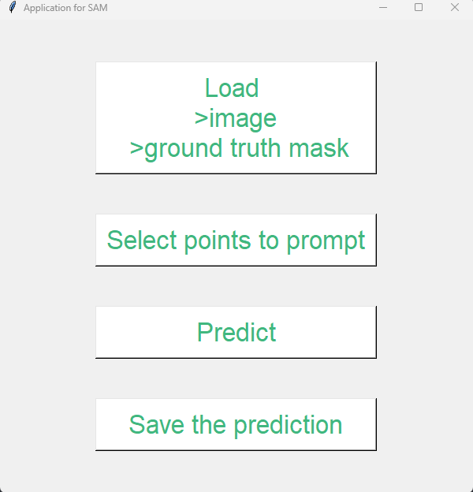

# SAM

This code aims to create an application to use [SAM](https://github.com/facebookresearch/segment-anything/tree/main) with points prompt in local.

The application allows to :
- Load the SAM predictor
- Choose the image to segment and the ground truth mask associated
- Select the points belonging to the mask (left click) and the points belonging to the background (right click)
- Predict the masks with those points prompt
- Save the figure with the masks predicted and the points chosen

# Usage

## Loading the application
```python
if __name__ == "__main__":
    app = App()
    app.window.mainloop()
```

To load the application you just have to run the file _application.py_.

It will open the following window :
<p align="center">
  
</p>

## Loading an image

Click on the first button _Load >image >ground truth mask_. The first load is the image you want to segment then it is the ground truth mask associated.

## Selecting points to prompt

Click on the second button _Select points to prompt_. It will open a window.

To add a point :
- _left click_ : point belonging to the mask (appears in green on the window)
- _right click_ : point belonging to the background (appears in red on the window)

Once you have chosen the points, just close the window (the one opened, not the application).

To reset the points selected click again on the button (_Select points to prompt_).

## Predict

Click on the third button _Predict_. It will plot the masks predicted with the points selected.

The points used are the lastest that were placed when you opened the window for selecting them.

## Save the prediction

Click on the last button _Save the prediction_. It will save the last image that were plotted.
